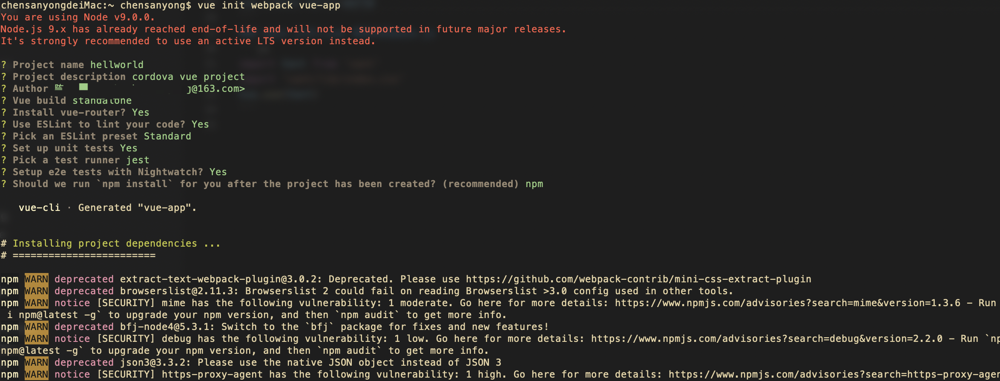

### 初始化VUE项目
> VueJS最近异常喜爱，有点好处我也不多说了，就是爱，就是爱。VueJS也有自己的命令行工具vue-cli，安装方如下：
```js
$ npm install -g vue-cli
$ vue init webpack my-project  //使用webpack模板初始化项目，每一步都有提示，很像之前bower构建项目的流程
```


更多资料请参考：vue-cli GitHub使用 vue-cli 构建项目很方便，webpack的各种配置也都会写好，不需要自己再编辑了。

如果需要使用vuex，vue-router等工具，需要自己添加，相应的网站都有详细的介绍，这里就不赘述了，贴出链接。vuejs文档、vue-router文档、vuex文档、Mint-ui项目打包配置可以把vue项目放到cordova项目的根目录下面，这样比较方便，可以将打包好的项目直接输出到cordova项目的www目录里。修改vue项目config目录下的index.js文件的build属性如下：
```js
index: path.resolve(__dirname,'../../www/index.html'),
assetsRoot: path.resolve(__dirname,'../../www'),
assetsSubDirectory:'static',
assetsPublicPath:"",  //原来的值是“/”，需要修改为“”
```
修改好之后，执行：`npm run build`，项目就会构建、打包、压缩输入到我们定义的`www`目录下边。此时来到cordova的根目录，执行：`cordova build android `命令，就可以打包出新的apk了。

### 载入`vant`

# 安装 Vue Cli
```js
npm i vant -S
```
# 创建一个项目
```js
vue create hello-world
```
### main.js引入vue 项目中的main.js
```js
import Vant from 'vant'
import 'vant/lib/index.css'
Vue.use(Vant)
```

