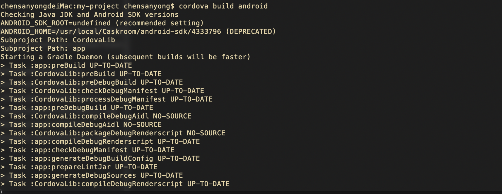

### 安装cordova

```js
sudo npm install -g cordova
```

### 创建一个项目

```js
cordova create hello com.example.hello HelloWorld
cd hello
cordova platform add ios
cordova platform add android
```

### 检查项目需要的安装环境

```js
cordova requirements
```

> 根据相关的提示内容去配置相关环境

### 编译


```js
 cordova build
 cordova build ios
 cordova build android
 ```

 
